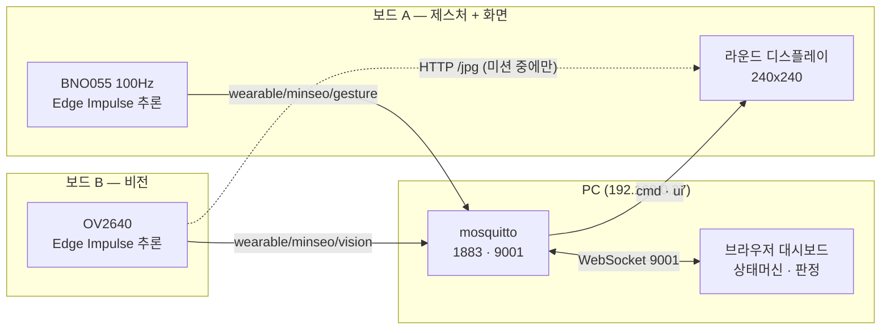
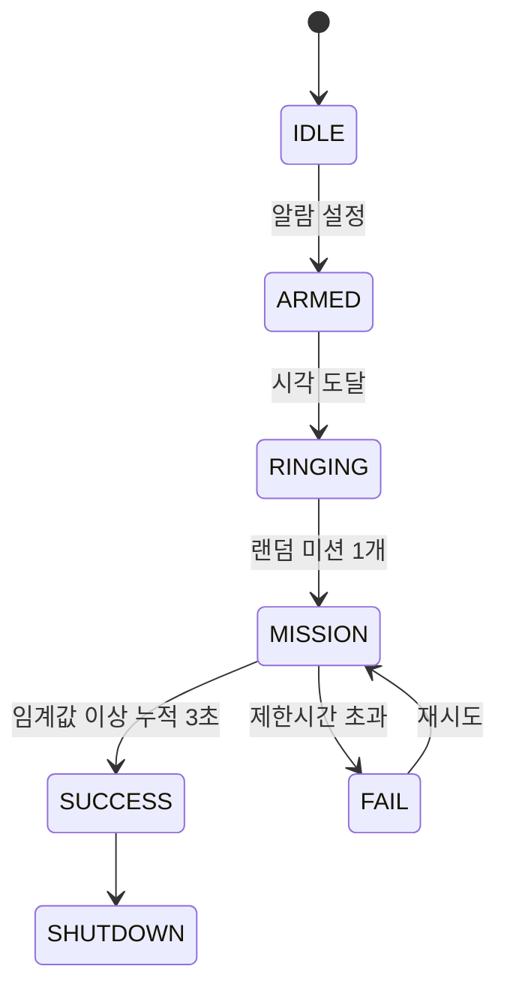

# 구현 원리 (발표용)

## 1. 한 장 요약



### 이 그림 읽는 법

**상자 세 덩어리 = 물리적으로 떨어져 있는 장치 세 개다.**

| 덩어리 | 실물 |
|---|---|
| PC | 노트북 한 대. 여기서 브로커(mosquitto)와 대시보드(브라우저)가 같이 돈다 |
| 보드 A | XIAO 한 개 + BNO055 + 라운드 디스플레이가 얹힌 것 |
| 보드 B | XIAO 한 개 + 카메라 |

**화살표 = 데이터가 흐르는 방향이고, 붙은 글자는 그 통로의 이름이다.**

| 화살표 | 무슨 일 |
|---|---|
| 보드 A → 브로커<br/>`wearable/minseo/gesture` | "지금 흔들고 있음, 확률 0.99" 를 0.25 초마다 올려보낸다 |
| 보드 B → 브로커<br/>`wearable/minseo/vision` | "컵이 보임, 확률 0.93" 을 0.7 초마다 올려보낸다 |
| 브로커 ↔ 대시보드<br/>`WebSocket 9001` | 양쪽 화살표다. 대시보드는 위 두 결과를 **받고**, 판정해서 명령을 **보낸다** |
| 브로커 → 보드 A<br/>`cmd · ui` | "이제 미션 상태다", "게이지 40 % 찼다" 를 화면 보드에 내려보낸다 |
| 보드 B ⇢ 보드 A<br/>`HTTP /jpg` | **점선**이다. 항상 흐르는 게 아니라 사물 미션 중에만 카메라 그림이 건너간다 |

**MQTT 를 지나가는 선(실선)과 안 지나가는 선(점선)의 차이가 중요하다.** 추론 결과와 명령은 전부 브로커를 경유한다 — 그래서 대시보드가 모든 걸 볼 수 있고, 노드를 추가해도 서로를 몰라도 된다. 반면 카메라 그림은 크기가 커서 브로커로 보내면 버퍼가 터진다. 그래서 그림만 보드끼리 직접 주고받는다.

### 왜 이렇게 나눴나

핵심은 **역할 분리**다.

| 주체 | 하는 일 | 안 하는 일 |
|---|---|---|
| 보드 | 센서 읽기 + **추론** + 발행 | 판정 안 함 |
| 대시보드 | **판정** + 상태 전이 | 추론 안 함 |
| 브로커 | 전달 + 상태 보관(retained) | 로직 없음 |

판정을 한 곳(대시보드)에만 두면 노드를 늘려도 규칙이 한 군데만 바뀐다. 노드는 "내가 뭘 봤는지"만 말하고, "그래서 알람을 끌지"는 대시보드가 정한다.

## 2. 왜 이 구조가 됐나

| 단계 | 구조 | 한계 |
|---|---|---|
| day3 | 보드가 자기 웹페이지를 서빙 | 보드가 N개면 페이지도 N개 |
| day4 | MQTT로 한 대시보드에 모음 | 값을 **보는** 시스템에 그침 |
| alarmi | 추론 결과를 **판정 근거**로 사용 | — |

값이 화면에 찍히기만 하면 모니터링 도구다. 그 값이 알람을 끄는 조건이 되는 순간 제품이 된다.

## 3. 서버(브로커) 여는 법

브라우저는 raw TCP 소켓을 못 열기 때문에 **포트가 두 개** 필요하다.

| 포트 | 프로토콜 | 누가 붙나 |
|---|---|---|
| 1883 | mqtt | ESP32 보드 |
| 9001 | websockets | 브라우저 대시보드 |

### 3-1. mosquitto 실행 (관리자 PowerShell)

```powershell
net stop mosquitto
& "C:\Program Files\mosquitto\mosquitto.exe" -c "<repo>\alarmi\dashboard\mosquitto-websockets.conf" -v
```

설정 파일에서 중요한 두 줄:

```conf
listener 1883 0.0.0.0     # 0.0.0.0 이어야 다른 기기(보드)가 붙는다
listener 9001 0.0.0.0
protocol websockets
```

**mosquitto 2.x는 리스너를 명시하지 않으면 localhost 에만 바인딩한다.** 이걸 모르면 브라우저는 붙는데 보드는 영원히 못 붙는다 — 가장 흔한 함정이다.

또 하나: Windows 서비스로 돌릴 때 `log_dest stdout` 을 쓰면 stdout 이 없어서 브로커가 시작 직후 죽는다. 반드시 파일로 지정한다.

### 3-2. 대시보드 서빙

```
alarmi\serve_dashboard.bat
```

`file://` 로 열면 브라우저가 WebSocket 을 막는다. 반드시 http 로 서빙해야 한다 — 폰에서 볼 때도 같다.

### 3-3. 확인

```powershell
Get-NetTCPConnection -State Listen -LocalPort 1883,9001
```

두 줄이 나오면 정상. 보드가 붙었는지는 시리얼 하트비트로 본다 (`arp -a` 는 캐시라 자주 비어 있어서 신뢰하기 어렵다):

```
[HB] up=23s wifi=3 rssi=-52 ip=192.168.0.94 mqtt=1 pub ok=22 fail=0
```

## 4. 토픽과 페이로드

| 토픽 | 방향 | retained | 내용 |
|---|---|---|---|
| `wearable/minseo/gesture` | 보드 A → | ✗ | 센서값 + 제스처 추론 |
| `wearable/minseo/vision` | 보드 B → | ✗ | 센서값 + 사물 추론 + `ip` |
| `wearable/minseo/cmd` | → 보드 | ✓ | 상태 전이 (armed/mission/…) |
| `wearable/minseo/ui` | → 보드 | ✗ | 해제 게이지 (5 Hz) |

### 자기기술(self-describing) 페이로드

센서마다 토픽을 쪼개지 않고, **값과 함께 그 값을 그리는 데 필요한 정보를 다 담는다.**

```json
{"node":"vision","kind":"camera",
 "sensors":{"brightness":{"v":133.21,"unit":"","label":"프레임 밝기","min":0,"max":255}},
 "inference":{"label":"cup","confidence":0.926,
              "scores":{"background":0.004,"cup":0.926,"mouse":0.055,"phonecase":0.016},
              "dsp_ms":4,"nn_ms":88}}
```

토픽을 센서별로 쪼개면 대시보드가 센서 종류를 전부 알아야 하고, 센서가 하나 늘 때마다 대시보드도 고쳐야 한다. 단위·라벨·범위를 메시지에 넣으면 **대시보드는 메시지만 해석해서 UI 를 스스로 그린다.** 노드를 추가해도 대시보드는 손대지 않는다.

### 양방향화

day4 까지는 발행 전용이라, 노드를 멈추려면 USB 를 뽑아야 했다. `cmd` 를 구독하게 만들어서 원격으로 추론 On/Off 와 미션 모드 전환이 된다.

```cpp
if (strstr(buf, "\"state\":\"mission\"")) en = ...;      // 내 미션일 때만 발행
else if (strstr(buf, "\"state\":\"success\"")) en = false;
```

### Retained 전략

#### 쉽게 — 브로커에 붙은 포스트잇

MQTT 는 원래 **라디오 방송**이다. 지금 켜놓은 사람만 듣고, 껐다 켜면 방금 나온 말은 못 듣는다.

retain 을 켜면 브로커가 그 말을 **포스트잇에 적어 붙여둔다.** 나중에 켠 사람도 붙어 있는 포스트잇을 바로 본다. 포스트잇은 토픽당 딱 한 장이고, 새 말이 오면 지우고 다시 쓴다.

**왜 붙여두나** — 보드는 전원이 빠지거나 다시 굽거나 하면서 자주 껐다 켜진다. 켜진 보드는 지금 뭐가 진행 중인지 모른다. 포스트잇이 있으면 켜자마자 "지금 알람 울리는 중" 을 읽고 바로 그 화면을 띄운다. 없으면 다음 신호가 올 때까지 멍하니 대기 화면을 띄우고 있다.

**근데 다 붙여두면 사고 난다** — 포스트잇은 "이거 아직 유효해" 라는 뜻이다. 그래서 아직 유효한 것만 붙여야 한다.

- "알람 울리는 중" → 계속 유효하다. 붙여둠 ✓
- "방금 실패했음" → 그 순간만 유효하다. 붙이면 안 됨 ✗

`실패` 를 붙여두면 이렇게 된다:

> 어제 미션 실패 → 포스트잇에 "실패" 남음
> 오늘 보드 전원 켬 → 포스트잇 읽음 → **아무것도 안 했는데 실패 화면이 뜸**

**기억할 한 줄:** *"나중에 켠 사람이 이 말을 읽어도 여전히 맞는 말인가?"* 맞으면 붙이고(상태), 아니면 안 붙인다(사건).

#### 정확하게

**Retained 가 뭔가.** MQTT 는 기본적으로 "지금 듣고 있는 사람에게만" 전달한다. 발행 시점에 구독자가 없으면 그 메시지는 그냥 사라진다. 그런데 발행할 때 retain 플래그를 켜면, **브로커가 그 토픽의 마지막 메시지 한 개를 보관**한다. 이후 누군가 그 토픽을 구독하면 브로커가 그 보관본을 **즉시** 보내준다.

토픽당 1 개만 남고, 새 메시지가 오면 덮어쓴다. 즉 retained 는 스트림이 아니라 **"이 토픽의 현재 값"** 을 저장하는 칸이다.

**왜 이게 필요한가.** 보드는 언제든 재부팅된다 (전원 뽑힘, 크래시, 재업로드). 재부팅한 보드는 자기가 어떤 상태였는지 모른다. retained 가 없으면 대시보드가 다음 상태 전이를 보낼 때까지 아무것도 모른 채 기다려야 한다 — 알람이 이미 울리는 중이었는데 보드만 `idle` 화면을 띄우고 있는 상황이 된다.

`cmd` 를 retained 로 두면 이 문제가 사라진다. 보드는 구독하는 순간 현재 상태를 받는다.

```cpp
mqtt.subscribe(CMD_TOPIC);   // retained 라 붙자마자 현재 상태를 받는다
```

**그런데 전부 켜면 안 된다.** 여기가 핵심이다. retained 는 "마지막 값이 계속 유효하다"는 뜻인데, **일회성 사건에는 그 전제가 성립하지 않는다.**

| 대상 | retain | 이유 |
|---|---|---|
| `armed` `ringing` `mission` `success` `shutdown` `idle` | ✓ | **상태** — 다시 바뀔 때까지 계속 참이다 |
| `fail` | ✗ | **사건** — 그 순간에만 참이다 |

`fail` 을 retained 로 남기면 이런 일이 생긴다:

1. 어제 미션에 실패 → `fail` 이 브로커에 보관됨
2. 오늘 보드에 전원을 넣음
3. 보드가 구독 → 브로커가 **어제의 `fail`** 을 현재 상태로 배달
4. 아무 일도 없었는데 실패 화면이 뜨고, 상태머신이 미션 재시도로 들어간다

그래서 코드에 발행 함수가 두 개다:

```js
function sendCmd(obj){          // 상태
  client.publish(`${base}/cmd`, JSON.stringify(obj), {retain:true});
}
function sendCmdNoRetain(obj){   // 순간적인 사건
  client.publish(`${base}/cmd`, JSON.stringify(obj), {retain:false});
}
```

`sendCmdNoRetain` 을 쓰는 곳은 `state:'fail'` 하나뿐이다.

**같은 이유로 `ui` 토픽도 retained 를 쓰지 않는다.** 해제 게이지는 5 Hz 로 계속 덮어써지는 값이라, 마지막 값을 보관해봐야 이미 지나간 눈금이다. 화면 쪽도 그걸 알고 있어서 2 초 넘게 `ui` 가 안 오면 게이지를 신뢰하지 않는다:

```cpp
if ((now - lastUi) < 2000 && deg > 0)   // ui 가 끊기면 링을 안 그린다
```

**정리하면 판단 기준은 하나다** — *"이 메시지를 나중에 접속한 사람이 받아도 여전히 참인가?"* 참이면 상태이므로 retain, 아니면 사건이므로 retain 하지 않는다.

> `shutdown` 도 retained 라, 성공으로 끝낸 상태가 그대로 보관된다. 다시 알람을 걸면 대시보드가 `idle` 을 retained 로 발행해 덮어쓴다 — 안 그러면 부팅할 때마다 종료 화면부터 뜬다.

## 5. 상태머신과 판정



판정 규칙은 대시보드에 있다:

> 해당 **노드**의 라벨이 임계값(기본 0.7) 이상으로 **누적 3초** 유지되면 통과

`if (nodeId !== m.node) return;` — 노드 단위로 걸러서, 두 노드가 동시에 발행해도 엉뚱한 노드가 미션을 통과시키지 않는다.

한 프레임만 맞아도 통과시키면 우연히 스쳐간 값으로 알람이 꺼진다. 그래서 **누적 시간**을 조건으로 둔다. 이게 "몸을 움직이게 한다"는 기획을 실제로 강제하는 부분이다.

## 6. 화면 (보드 A)

원래 설계는 화면 전용 보드를 따로 두는 3-보드 구성이었지만, 실제 하드웨어가 XIAO 2 개이고 라운드 디스플레이가 제스처 보드에 달려 있어 **한 보드가 제스처 추론과 화면을 겸한다** (`15_gesture_clock_node`).

7 개 상태를 각각 다른 이미지로 그린다. 사물 미션만 특별하다:

```
mission(object) → 미션 이미지 3초 → 비전 노드의 카메라 화면
mission(gesture) → shake.c / circle.c 유지
```

카메라는 이 보드에 없으므로 비전 노드의 `/jpg` 를 HTTP 로 받아 그린다 (240x240 JPEG, 약 4.5 KB). **카메라는 사물 미션 구간에만 켠다** — 다른 상태에서 긁으면 비전 노드의 카메라와 Wi-Fi 를 공짜로 소모한다.

주소는 하드코딩하지 않는다. 비전 노드가 자기 `ip` 를 발행하고 화면 보드가 그걸 받아 쓴다 — DHCP 로 IP 가 실제로 바뀌기 때문이다.

## 7. 온디바이스 추론

추론은 전부 보드 안에서 끝난다. 영상과 센서 데이터가 **외부 서버로 나가지 않는다.** 네트워크는 노드 간 조율(MQTT)과 화면 전송(LAN)에만 쓴다.

| | 제스처 | 비전 |
|---|---|---|
| 입력 | BNO055 선형가속도 3축 @100 Hz | OV2640 96x96 RGB |
| 모델 | Spectral Analysis + 분류 | MobileNetV1 0.25 전이학습 |
| 양자화 | int8 | int8 (EON) |
| 추론 시간 | — | 87 ms |
| 정확도(int8) | — | 97.9 % |

> 판정 자체는 대시보드가 하므로, Wi-Fi 가 끊기면 추론은 계속되지만 미션 통과 판정은 멈춘다.

## 8. 시연 순서

1. `mosquitto` 실행 → `Get-NetTCPConnection` 으로 1883/9001 확인
2. `alarmi\serve_dashboard.bat` → 브라우저에서 [연결]
3. 보드 전원 → 시리얼 하트비트로 `wifi=3 mqtt=1 pub ok` 확인
4. 손을 흔들어 `idle → shaking` 카드 반응 확인
5. 10 초 테스트 알람 → 카운트다운 → 미션 등장
6. 미션 수행 → 게이지 차오름 → CLEAR

안전장치: 보드가 안 붙어도 대시보드 버튼만으로 전체 흐름을 끝까지 보여줄 수 있고, 미션을 제스처로 고정하면 비전 인식 변수를 피할 수 있다.
